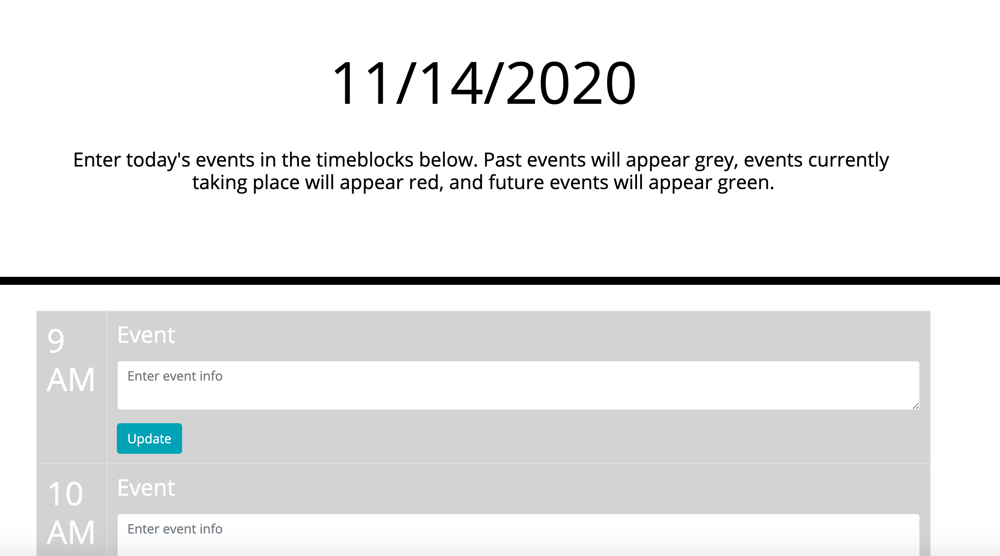
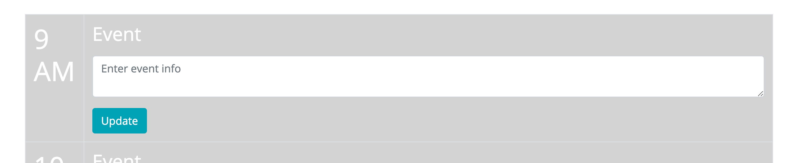
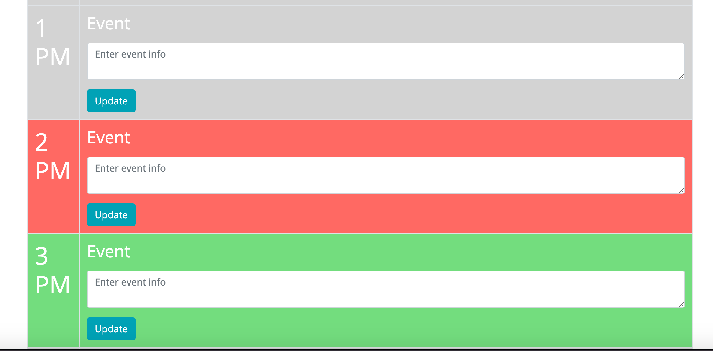

# calendar-app

# Description

For this assignment, we were tasked with creating a daily planning app, which allows a user to add events in time blocks in a schedule of 9am to 5am.

---

# User Guide

1. Scroll through the page and look over each hour-long timeblock within a period of 9am to 5pm (Note: timeblocks in the past will appear grey, the timeblock for the current hour will appear red, and timeblocks in the future will appear green)
2. Enter event information such as a description and notes into the text box of the appropriate timeblock
3. Click update
4. When you refresh or return to the page, your saved events will remain
5. Repeat the above process to change an event for any timeblock

---

# Approach

The first step I took was to build out the basic structure of the page using html and Bootstrap for styling. I think psuedocoded the functionality in the javascript portion of the file. 

For the first dynamic functionality, I used the moment.js library to display the current date at the top of the page, and formatted it as MM/DD/YYYY.

I then created the color-coded functionality. To do this I created a set of conditionals for each timeblock. Each timeblock row had a data attribute that represented the its corresponding hour. Using this data attribute along with the conditional, I was able to dynamically change the color of each timeblock based on a comparison of the data attribute to the current hour.

Next I added the event listeners to all of the 'Update' buttons. By clicking update, an event handler is triggered, which saves the corresponding text area value to the local storage.

Finally, I created a function that runs on page load that inserts any saved text values from the corresponding timeblock into the text area. 

---

# Screenshots

